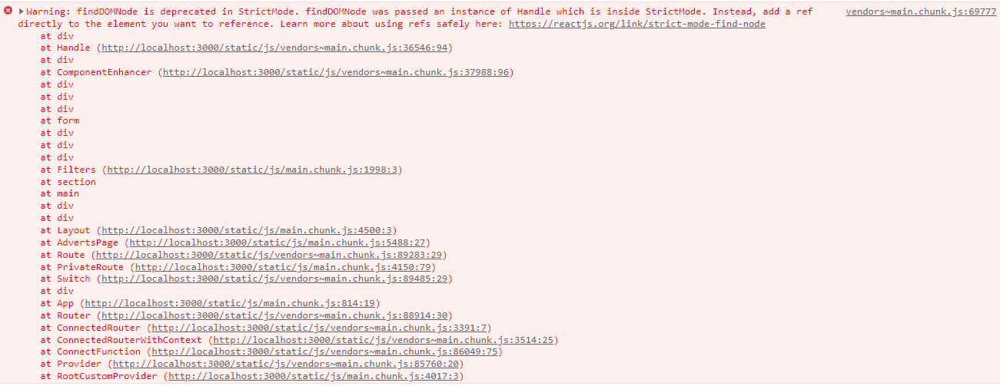
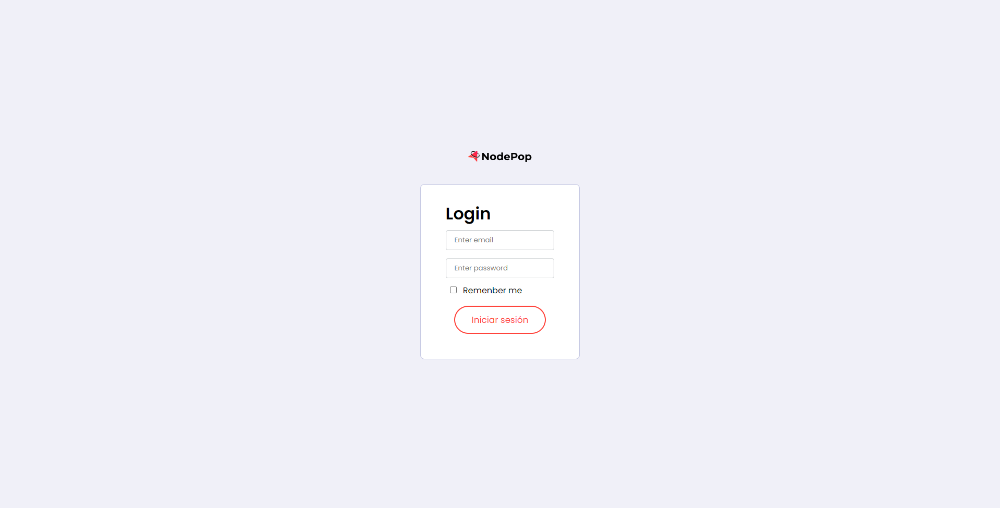
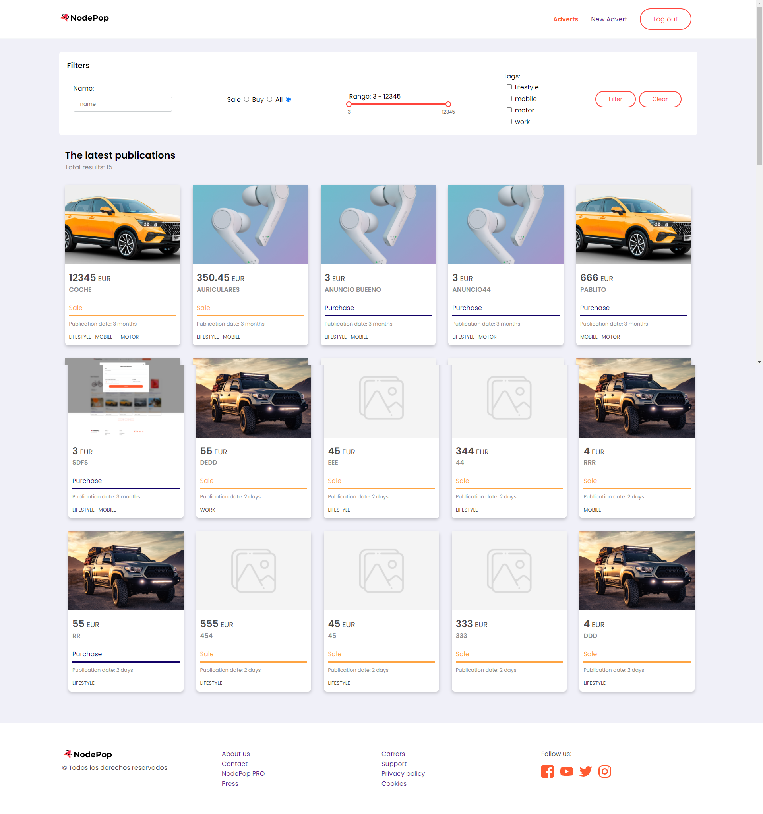
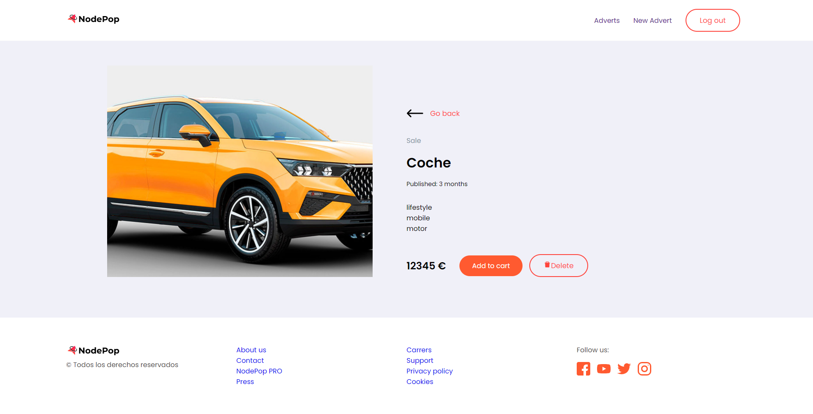
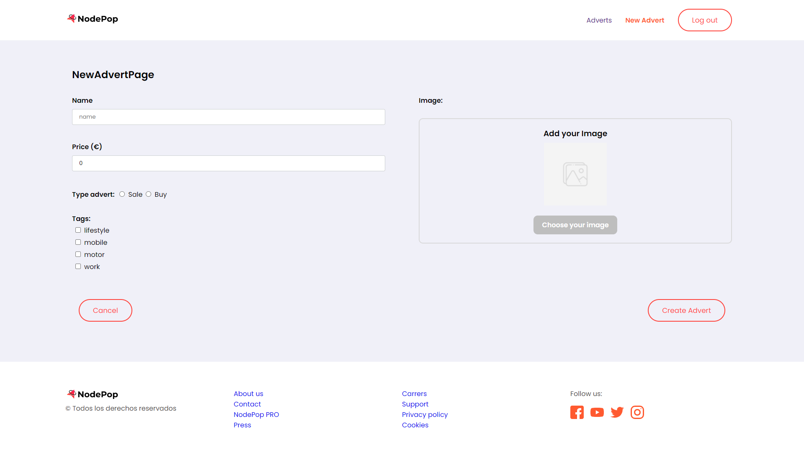
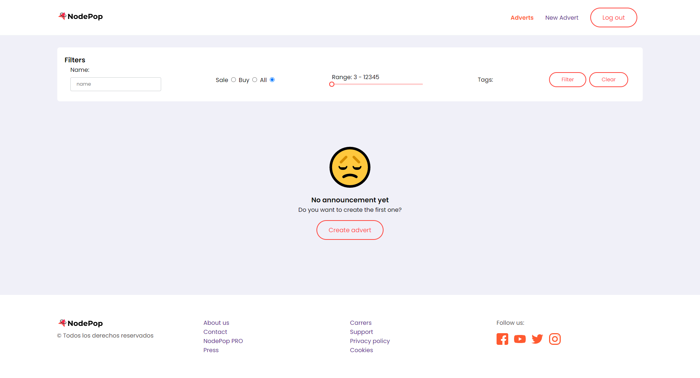
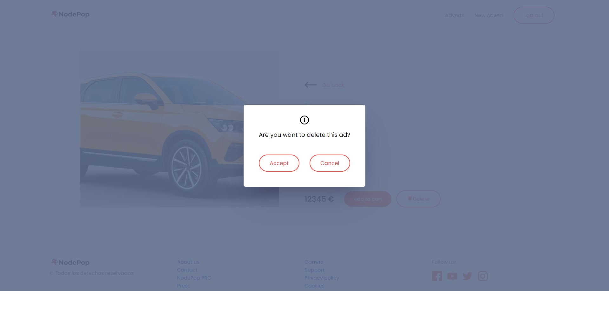
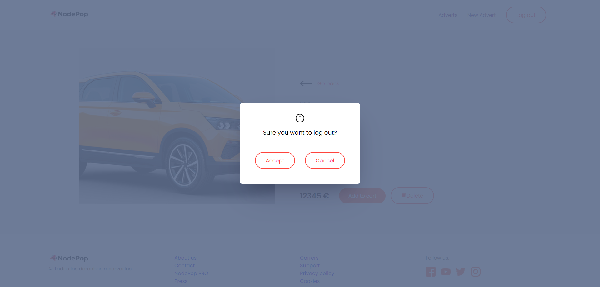

# Entrega de la práctica del módulo 11 - React Avanzado (Redux)

Para esta práctica usaremos de punto de inicio la práctica que se realizó en el
modulo de fundamentos.
https://gitkc.cloud/pablopsdigital/web11_modulo07_fundamentos_de_react_practica

### Principales Objetivos de la práctica

1. Configurar un store Redux gestionando la autenticación, el localStorage y gestión de anuncios (listado y detalle).
2. Crear las acciones y reducers necesarios.
3. Conectar los componentes con el store de redux con connect o hooks
4. Configurar Redux Dev Tools para simplificar las tareas de debugging
5. Testing. Crear tests unitarios, dando al menos un ejemplo de:
   - Una acción síncrona
   - Una acción asíncrona
   - Un reducer
   - Un selector
   - Un componente con snapshot testing
   - Un componente que ejecuta una acción del store, mockeando la acción
6. OPCIONAL: (Formularios): Extraer lógica común de los formularios y reutilizarlos en los disintos formularios, por ejemplo creando un componente `<Form/>` que mantenga los valores del formulario y un `<Input/>` que reciba el valor que le corresponde así como la función necesaria para poder modificar ese valor en el evento onChange.

Se puede acceder al enunciado completo de la práctica.  
[Enunciado completo de la práctica](documentation/enunciado.pdf)

# Vídeo funcionamiento

<a href="https://www.loom.com/share/37a8914b2f6446e5bdf104ad0c130d64">
    
    
Ver Video

  </a>

# Instalación servidor de pruebas

La tarea está basada en el uso del servidor **nodepop-api**. Se pueden seguir las instrucciones de instalación desde el siguiente link: https://github.com/davidjj76/nodepop-api

    git clone https://github.com/davidjj76/nodepop-api.git

Con el servidor instalado, es necesario realizar el mismo proceso con el proyecto front-end, para ello se debe clonar el proyecto desde esta dirección: https://gitkc.cloud/pablopsdigital/web11_modulo11_react_avanzado_practica.git

    git clone https://gitkc.cloud/pablopsdigital/web11_modulo11_react_avanzado_practica.git

Finalmente se instalan las dependencias de ambos proyectos ejecutando

    npm install

y por último se levantaran cada uno de los proyectos ejecutando

    npm start

Se puede comprobar si el servidor se encuentra funcionando añadiendo la siguiente url en el navegador de forma que se obtendrá una lista de anuncio en formato json.
http://localhost:3001/api/v1/adverts

Se puede acceder a la documentación del api en la ruta:
http://localhost:3001/swagger/#/

Se puede acceder al proyecto desde la ruta:
http://localhost:3000/

# Ejecución de test

Para la ejecución de los diferentes test implementados será necesario ejecutar el comando:

    npm run test

De forma adicional se puede visualizar la cobertura con el comando:

    npm run coverage

# Notas

El slider implementado (rc-slider) de los filtros, lanza un warning al comenzar a modificar el rango de precios (`findDOMNode is deprecated in StrictMode`) este es un error definido a nivel interno del componente.

Algunos enlaces al problema: https://github.com/react-component/slider/issues/750

# Capturas

